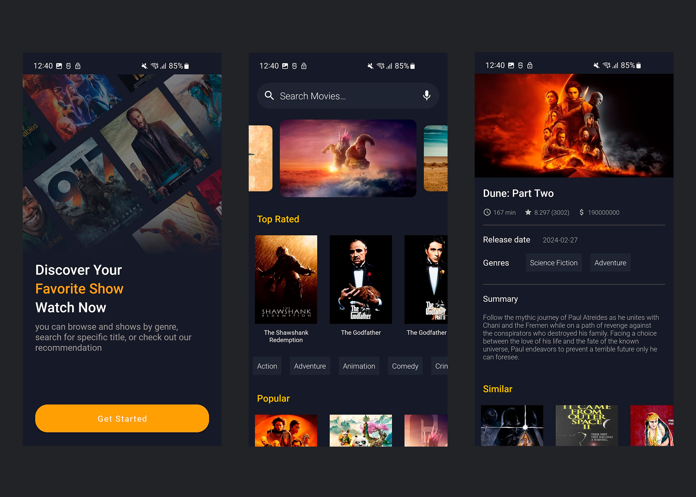

# FreeCast Challenge

- Last updated: 2023-05-02

# What's Done

The project was developed using the following technological stacks:

- MVVM + Clean Architecture pattern with a focus on modularity.
- Kotlin
- Retrofit
- OkHttp
- Koin DI
- Glide for image processing
- Error handling.

In accordance with the requirements, it was decided to use the old ExoPlayer. However, since ExoPlayer does not support direct video loading from YouTube, it needs to be replaced with the YouTube Player.

# What Could Have Been Done with More Time:

- Fully cover the UI and module code with tests to ensure a higher level of reliability and stability of the application.
- Optimize the main menu for more dynamic, flexible, and faster loading, improving the user experience.
- Expand the functionality of the application by adding new features and improving existing ones.
- In the future, with more functionality, it would be good to divide the modules by features for easier maintenance and scalability.
- I didn't have time to refactor some parts of the code, such as DetailMovieFragment, to improve its readability and maintainability.
- Could have integrated useful tools such as Firebase Crashlytics for real-time monitoring and error tracking.
- Use NDK for more secure storage of keys and other confidential data in the application.
- Develop an advanced error handler for more efficient management and display of errors in the application.

# The project consists of 3 screens:

- Onboarding
- Main Screen
- Detailed Movie Information
The design was sourced from several different origins.

[Information Mobile App Design](https://www.figma.com/file/I62gWERAcJhZaJJaYWUAzn/Movie-Streaming-App-(Community)?type=design&node-id=0-1&mode=design&t=ZcuZBj31kT1OcmBL-0)

